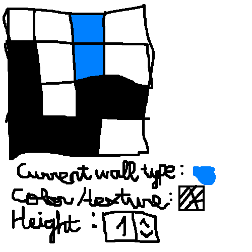
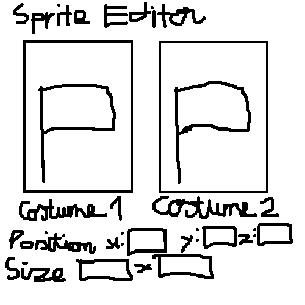
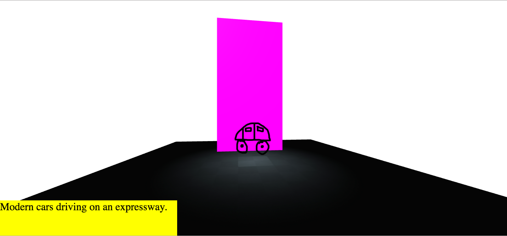

# Welcome to Hoc462! <sup>[Chat here!](https://github.com/khanh2003/Hoc462/issues/10)</sup>
## How to use it?
There's not much inside Hoc462. Just boring walls. [Demo here.](https://khanh2003.github.io/Hoc462)

This repository is using a raycasting engine. But raycasting is slow on mobile so I gave up.
Now I am developing Hoc462 in a private Glitch app. [Demo here.](https://hoc462.glitch.me)

## What is Hoc462?
Hoc462 is an app for creating 3D presentations quickly and easily.
To create a Hoc462 presentation:

**Step 1:** Create a map.



You need to set color/texture and height for walls.

**Step 2:** Add sprites.



Then set position and size for sprites. Sprites can have multiple costumes.

**Step 3:** Add animations and some text.

```
Slide 1
Caption: Modern cars driving on an expressway.
-+-------------
 |
 +-- Morph car sprite from costume 1 to costume 2
 |    |
 |    +-- Easing: Linear
 +-- Move camera from (3, 3) to (5, 3)
```

Hooray! You created your first Hoc462 presentation!


